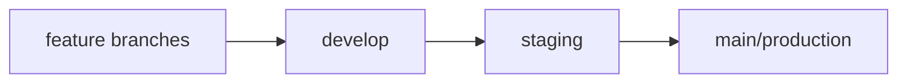

# Environment Configuration Guide

## Branch Strategy

### 🚀 Production (main branch)
- **URL**: https://trade-area-analysis-2png.vercel.app
- **Database**: Supabase Production Project
- **Auto-deploy**: ✅ Enabled
- **Testing**: ❌ No direct testing - only deploy stable code

### 🧪 Staging (staging branch)  
- **URL**: https://trade-area-analysis-2png-git-staging.vercel.app
- **Database**: Supabase Staging Project (separate database)
- **Auto-deploy**: ✅ Enabled
- **Testing**: ✅ Test all features here before merging to main

### 💻 Development (develop branch)
- **URL**: http://localhost:5173
- **Database**: Local Docker PostgreSQL OR Supabase Dev Project
- **Auto-deploy**: ❌ Local only
- **Testing**: ✅ Initial development and unit testing

## Workflow



### Development Workflow:
1. **Create feature branch** from `develop`
2. **Develop locally** on `develop` branch
3. **Merge to staging** for integration testing
4. **Test thoroughly** on staging environment
5. **Merge to main** for production deployment

### Environment Variables by Branch:

#### Production (main):
```env
VITE_SUPABASE_URL=https://your-prod-project.supabase.co
VITE_SUPABASE_ANON_KEY=prod_anon_key
VITE_MAPBOX_TOKEN=prod_mapbox_token
VITE_OPENAI_API_KEY=prod_openai_key
VITE_ENVIRONMENT=production
```

#### Staging (staging):
```env
VITE_SUPABASE_URL=https://your-staging-project.supabase.co
VITE_SUPABASE_ANON_KEY=staging_anon_key
VITE_MAPBOX_TOKEN=staging_mapbox_token
VITE_OPENAI_API_KEY=staging_openai_key
VITE_ENVIRONMENT=staging
```

#### Development (develop):
```env
VITE_SUPABASE_URL=https://your-dev-project.supabase.co
VITE_SUPABASE_ANON_KEY=dev_anon_key
VITE_MAPBOX_TOKEN=dev_mapbox_token
VITE_OPENAI_API_KEY=dev_openai_key
VITE_ENVIRONMENT=development
```

## Vercel Configuration

### Project Settings:
- **Production Branch**: `main`
- **Preview Branches**: `staging` (auto-deploy enabled)
- **Development Branches**: `develop` (ignored by Vercel)

### Deployment Commands:
- **Build Command**: `cd frontend && npm run build`
- **Output Directory**: `frontend/dist`
- **Install Command**: `cd frontend && npm install`

## Testing Strategy

### 1. Local Development (`develop`)
- Unit tests: `npm test`
- Integration tests: `npm run test:integration`
- Local server: `npm run dev`

### 2. Staging Testing (`staging`)
- Full feature testing
- User acceptance testing
- Performance testing
- Cross-browser testing

### 3. Production (`main`)
- Monitoring only
- Hot-fix deployments only
- No experimental features

## Database Strategy

### Production Database:
- Real user data
- Regular backups
- Performance monitoring
- Minimal schema changes

### Staging Database:
- Test data only
- Can be reset/recreated
- Schema migration testing
- Load testing

### Development Database:
- Local Docker OR Supabase dev project
- Seed data for testing
- Fast iteration
- No data persistence requirements

## Deployment Limits Management

### Vercel Free Tier (100 deployments/day):
- **Production**: ~5 deployments/day (critical fixes only)
- **Staging**: ~20 deployments/day (feature testing)
- **Development**: Local only (0 deployments)

### Best Practices:
1. Batch multiple features in staging
2. Test thoroughly locally before staging
3. Use staging for final validation only
4. Keep production deployments minimal

## Emergency Procedures

### Hot-fix Process:
1. Create `hotfix/fix-name` branch from `main`
2. Apply minimal fix
3. Test locally
4. Deploy directly to `main` (skip staging for emergencies)
5. Merge back to `staging` and `develop`

### Rollback Process:
1. Identify last working commit on `main`
2. Revert to that commit
3. Force push to `main` (emergency only)
4. Fix issue on `staging` first
5. Re-deploy proper fix to `main`